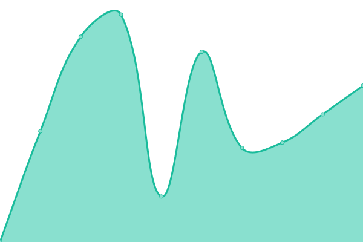
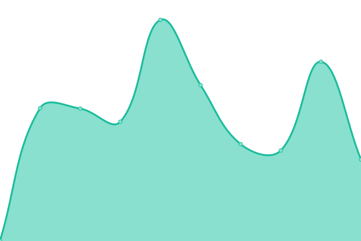
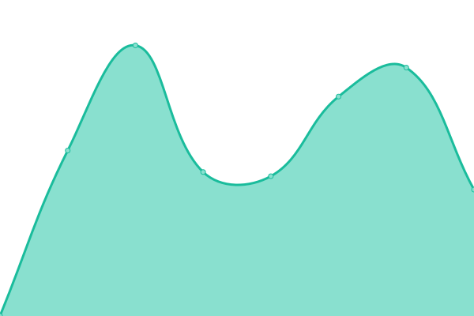
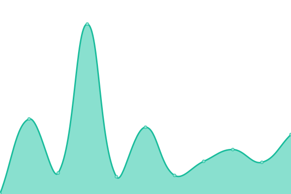
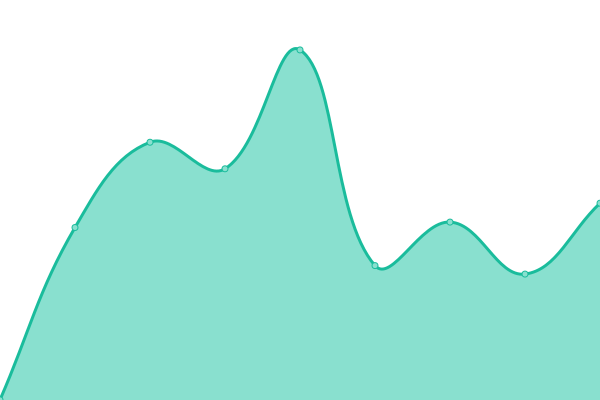

# [📈 Live Status](https://StarCitizenToolBox.github.io/upptime): <!--live status--> **🟩 All systems operational**

This repository contains the open-source uptime monitor and status page for [StarCitizenToolBox](https://StarCitizenToolBox.github.io/upptime), powered by [Upptime](https://github.com/upptime/upptime).

With [Upptime](https://upptime.js.org), you can get your own unlimited and free uptime monitor and status page, powered entirely by a GitHub repository. We use [Issues](https://github.com/StarCitizenToolBox/uptime/issues) as incident reports, [Actions](https://github.com/StarCitizenToolBox/uptime/actions) as uptime monitors, and [Pages](https://StarCitizenToolBox.github.io/uptime) for the status page.

<!--start: status pages-->
<!-- This summary is generated by Upptime (https://github.com/upptime/upptime) -->
<!-- Do not edit this manually, your changes will be overwritten -->
<!-- prettier-ignore -->
| URL | Status | History | Response Time | Uptime |
| --- | ------ | ------- | ------------- | ------ |
|  [GitApi](https://git.scbox.xkeyc.cn/SCToolBox/Api/raw/branch/main/sc_doctor/version.json) | 🟩 Up | [git-api.yml](https://github.com/StarCitizenToolBox/uptime/commits/HEAD/history/git-api.yml) | 

 1240ms
     
 | 

<a href="https://StarCitizenToolBox.github.io/uptime/history/git-api">100.00%</a>
    

|  [GitApi-HK-mirror](https://gitapi.scbox.org/SCToolBox/Api/raw/branch/main/sc_doctor/version.json) | 🟩 Up | [git-api-hk-mirror.yml](https://github.com/StarCitizenToolBox/uptime/commits/HEAD/history/git-api-hk-mirror.yml) | 

 1139ms
     
 | 

<a href="https://StarCitizenToolBox.github.io/uptime/history/git-api-hk-mirror">98.86%</a>
    

|  [GitApi-EdgeOneCdn](https://ecdn.git.scbox.xkeyc.cn/SCToolBox/Api/raw/branch/main/sc_doctor/version.json) | 🟩 Up | [git-api-edge-one-cdn.yml](https://github.com/StarCitizenToolBox/uptime/commits/HEAD/history/git-api-edge-one-cdn.yml) | 

 1286ms
     
 | 

<a href="https://StarCitizenToolBox.github.io/uptime/history/git-api-edge-one-cdn">99.10%</a>
    

|  [GitApi-ESA](https://acdn.git.scbox.xkeyc.cn/SCToolBox/Api/raw/branch/main/sc_doctor/version.json) | 🟩 Up | [git-api-esa.yml](https://github.com/StarCitizenToolBox/uptime/commits/HEAD/history/git-api-esa.yml) | 

 1742ms
     
 | 

<a href="https://StarCitizenToolBox.github.io/uptime/history/git-api-esa">100.00%</a>
    

|  [GitApi-mirror-Cloudflare](https://gitapi.scbox.org/SCToolBox/Api/raw/branch/main/sc_doctor/version.json) | 🟩 Up | [git-api-mirror-cloudflare.yml](https://github.com/StarCitizenToolBox/uptime/commits/HEAD/history/git-api-mirror-cloudflare.yml) | 

 384ms
     
 | 

<a href="https://StarCitizenToolBox.github.io/uptime/history/git-api-mirror-cloudflare">98.86%</a>
    

|  [News-api-EdgeOne](https://ecdn.news.scbox.xkeyc.cn/api/latest) | 🟩 Up | [news-api-edge-one.yml](https://github.com/StarCitizenToolBox/uptime/commits/HEAD/history/news-api-edge-one.yml) | 

 1410ms
     
 | 

<a href="https://StarCitizenToolBox.github.io/uptime/history/news-api-edge-one">99.12%</a>
    

|  [News-api-ESA](https://acdn.news.scbox.xkeyc.cn/api/latest) | 🟩 Up | [news-api-esa.yml](https://github.com/StarCitizenToolBox/uptime/commits/HEAD/history/news-api-esa.yml) | 

 2319ms
     
 | 

<a href="https://StarCitizenToolBox.github.io/uptime/history/news-api-esa">100.00%</a>
    

|  [42Nav-EdgeOne](https://ecdn.42nav.xkeyc.cn) | 🟩 Up | [42-nav-edge-one.yml](https://github.com/StarCitizenToolBox/uptime/commits/HEAD/history/42-nav-edge-one.yml) | 

 695ms
     
 | 

<a href="https://StarCitizenToolBox.github.io/uptime/history/42-nav-edge-one">99.14%</a>
    

|  [42Nav-ESA](https://acdn.42nav.xkeyc.cn) | 🟩 Up | [42-nav-esa.yml](https://github.com/StarCitizenToolBox/uptime/commits/HEAD/history/42-nav-esa.yml) | 

 1462ms
     
 | 

<a href="https://StarCitizenToolBox.github.io/uptime/history/42-nav-esa">100.00%</a>
    

|  [Release-EdgeOne](https://ecdn.release.scbox.xkeyc.cn/index.json) | 🟩 Up | [release-edge-one.yml](https://github.com/StarCitizenToolBox/uptime/commits/HEAD/history/release-edge-one.yml) | 

 293ms
     
 | 

<a href="https://StarCitizenToolBox.github.io/uptime/history/release-edge-one">99.16%</a>
    

|  [Release-ESA](https://acdn.release.scbox.xkeyc.cn/index.json) | 🟩 Up | [release-esa.yml](https://github.com/StarCitizenToolBox/uptime/commits/HEAD/history/release-esa.yml) | 

 1352ms
     
 | 

<a href="https://StarCitizenToolBox.github.io/uptime/history/release-esa">100.00%</a>
    

<!--end: status pages-->

[**Visit our status website →**](https://StarCitizenToolBox.github.io/uptime)

## 📄 License

- Powered by: [Upptime](https://github.com/upptime/upptime)
- Code: [MIT](./LICENSE) © [Anand Chowdhary](https://anandchowdhary.com), supported by [Pabio](https://pabio.com)
- Data in the `./history` directory: [Open Database License](https://opendatacommons.org/licenses/odbl/1-0/)
