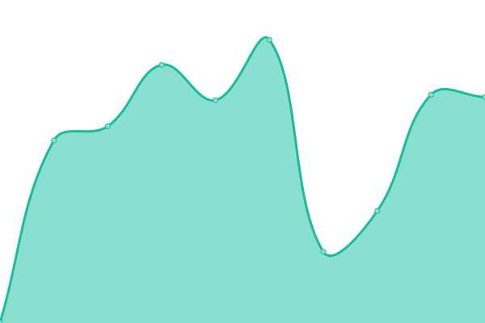
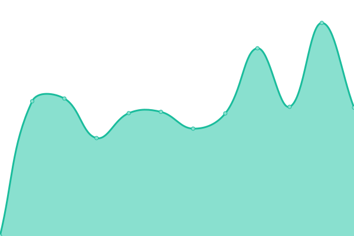

# [📈 Live Status](https://StarCitizenToolBox.github.io/upptime): <!--live status--> **🟧 Partial outage**

This repository contains the open-source uptime monitor and status page for [StarCitizenToolBox](https://StarCitizenToolBox.github.io/upptime), powered by [Upptime](https://github.com/upptime/upptime).

With [Upptime](https://upptime.js.org), you can get your own unlimited and free uptime monitor and status page, powered entirely by a GitHub repository. We use [Issues](https://github.com/StarCitizenToolBox/uptime/issues) as incident reports, [Actions](https://github.com/StarCitizenToolBox/uptime/actions) as uptime monitors, and [Pages](https://StarCitizenToolBox.github.io/uptime) for the status page.

<!--start: status pages-->
<!-- This summary is generated by Upptime (https://github.com/upptime/upptime) -->
<!-- Do not edit this manually, your changes will be overwritten -->
<!-- prettier-ignore -->
| URL | Status | History | Response Time | Uptime |
| --- | ------ | ------- | ------------- | ------ |
|  [GitApi](https://git.scbox.xkeyc.cn/SCToolBox/Api/raw/branch/main/sc_doctor/version.json) | 🟩 Up | [git-api.yml](https://github.com/StarCitizenToolBox/uptime/commits/HEAD/history/git-api.yml) | 

 1201ms
     
 | 

<a href="https://StarCitizenToolBox.github.io/uptime/history/git-api">100.00%</a>
    

|  [GitApi-HK-mirror](https://gitapi.scbox.org/SCToolBox/Api/raw/branch/main/sc_doctor/version.json) | 🟩 Up | [git-api-hk-mirror.yml](https://github.com/StarCitizenToolBox/uptime/commits/HEAD/history/git-api-hk-mirror.yml) | 

 716ms
     
 | 

<a href="https://StarCitizenToolBox.github.io/uptime/history/git-api-hk-mirror">99.64%</a>
    

|  [GitApi-EdgeOneCdn](https://ecdn.git.scbox.xkeyc.cn/SCToolBox/Api/raw/branch/main/sc_doctor/version.json) | 🟥 Down | [git-api-edge-one-cdn.yml](https://github.com/StarCitizenToolBox/uptime/commits/HEAD/history/git-api-edge-one-cdn.yml) | 

 1032ms
     
 | 

<a href="https://StarCitizenToolBox.github.io/uptime/history/git-api-edge-one-cdn">99.89%</a>
    

|  [GitApi-mirror-Cloudflare](https://gitapi.scbox.org/SCToolBox/Api/raw/branch/main/sc_doctor/version.json) | 🟩 Up | [git-api-mirror-cloudflare.yml](https://github.com/StarCitizenToolBox/uptime/commits/HEAD/history/git-api-mirror-cloudflare.yml) | 

 258ms
     
 | 

<a href="https://StarCitizenToolBox.github.io/uptime/history/git-api-mirror-cloudflare">99.64%</a>
    

|  [News-api-EdgeOne](https://ecdn.news.scbox.xkeyc.cn/api/latest) | 🟥 Down | [news-api-edge-one.yml](https://github.com/StarCitizenToolBox/uptime/commits/HEAD/history/news-api-edge-one.yml) | 

 1289ms
     
 | 

<a href="https://StarCitizenToolBox.github.io/uptime/history/news-api-edge-one">99.89%</a>
    

<!--end: status pages-->

[**Visit our status website →**](https://StarCitizenToolBox.github.io/uptime)

## 📄 License

- Powered by: [Upptime](https://github.com/upptime/upptime)
- Code: [MIT](./LICENSE) © [Anand Chowdhary](https://anandchowdhary.com), supported by [Pabio](https://pabio.com)
- Data in the `./history` directory: [Open Database License](https://opendatacommons.org/licenses/odbl/1-0/)
